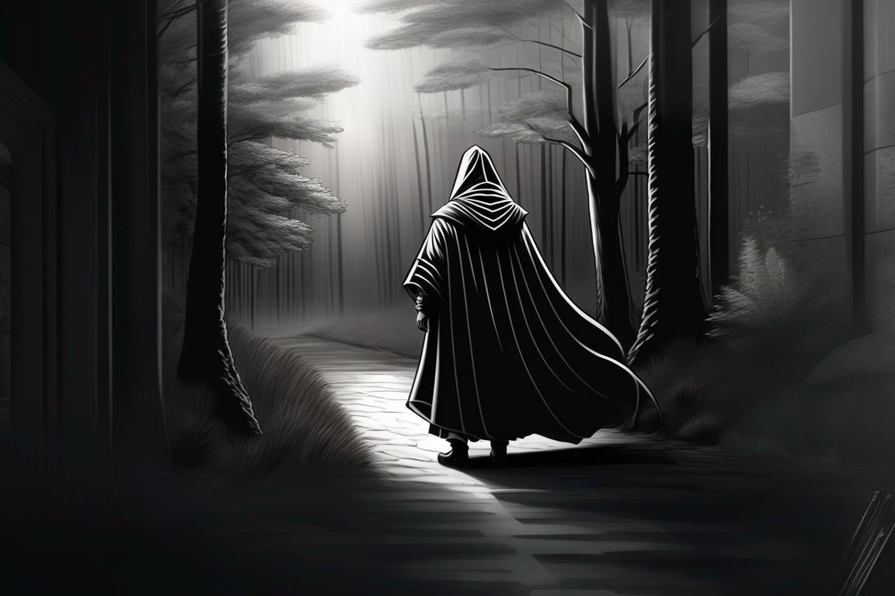
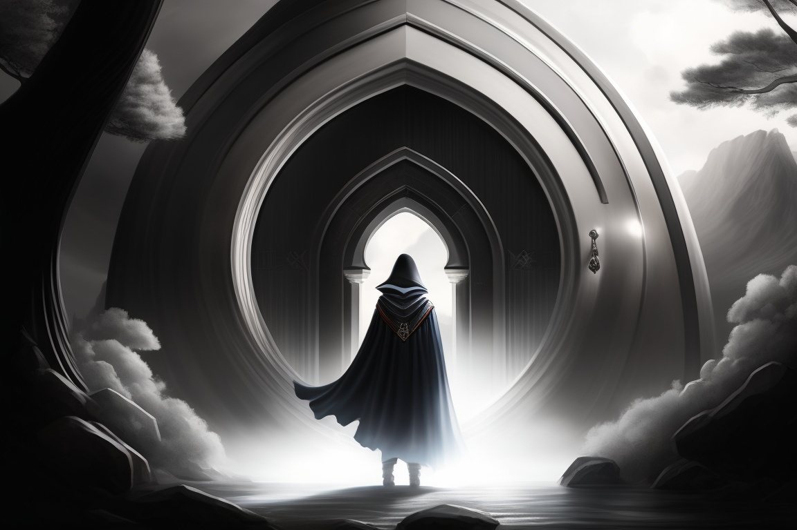
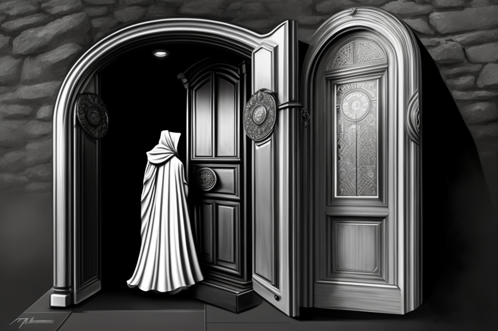

# Word-Game-Web 

Welcome to the Word-Game-Web ! This repository contains an interactive storytelling experience that offers a unique way to explore a developer's skills and expertise.

## Overview

The Word-Game-Web  is structured as a series of chapters, each representing a stage in the recruitment journey. Through interactive storytelling, users can navigate through different scenarios and choices to gain insights into the developer's capabilities.

## Getting Started

To begin your adventure:

1. Clone this repository to your local machine.
2. Open the `index.html` file in your preferred web browser.

## How to Play

- Start at Chapter 1: The Beginning and make choices that determine the course of your adventure.
- Navigate through the story by selecting options presented to you.
- Each choice leads to different chapters, unveiling more about the developer's skills and experiences.
- Explore the chapters to gain a comprehensive understanding of the developer's proficiency in various technologies.

## Features

- Engaging storytelling experience.
- Multiple branching paths based on user choices.
- Insights into the developer's skills across HTML/CSS, JavaScript, React, Node.js, and more.
- Interactive elements such as images and options for immersive gameplay.

## Screenshots

Here are some screenshots from Wrod-Game:

- Chapter 1: 
- Chapter 2: 
- Chapter 3: 

## Credits

- Word-Game-Web  developed by Jofiel.

## Feedback and Support

If you encounter any issues or have suggestions for improvement, feel free to reach out to the developer.

## Enjoy Your Adventure!

Thank you for exploring the Word-Game-Web . Embark on this journey to uncover the developer's skills and experience like never before! 🚀
